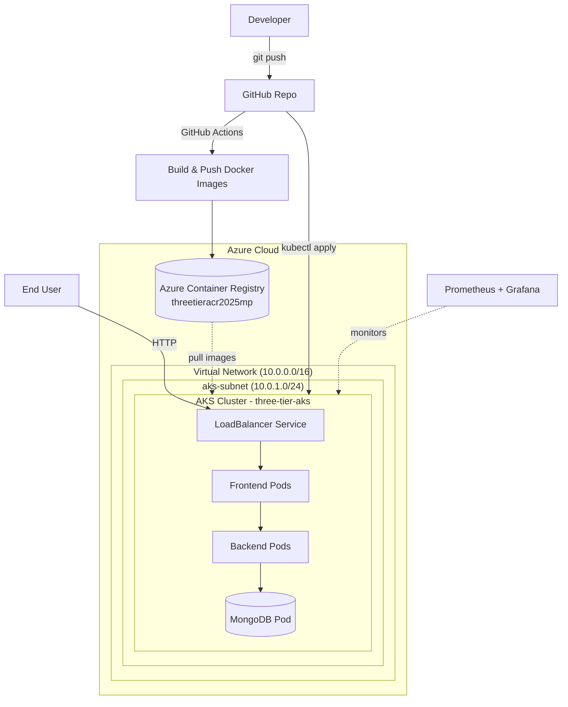

# Three-Tier Application on Azure Kubernetes Service (AKS)

An end-to-end deployment of a containerized three-tier web application on **Azure Kubernetes Service**, fully provisioned with **Terraform**, automated via **GitHub Actions CI/CD**, and monitored with **Prometheus & Grafana**.

This project demonstrates the complete cloud-native application lifecycle: Infrastructure as Code → Containerization → Orchestration → CI/CD → Observability.

## Architecture



## Tech Stack

| Category | Tools |
|---|---|
| Cloud Provider | Microsoft Azure |
| Infrastructure as Code | Terraform |
| Container Orchestration | Azure Kubernetes Service (AKS) |
| Containerization | Docker |
| Container Registry | Azure Container Registry (ACR) |
| CI/CD | GitHub Actions |
| Monitoring | Prometheus, Grafana (via Helm) |

## What Gets Provisioned

Running the Terraform configuration creates:

- **Resource Group** — `three-tier-rg`
- **Virtual Network** — `three-tier-aks-vnet` (`10.0.0.0/16`)
- **Subnet** — `aks-subnet` (`10.0.1.0/24`)
- **Azure Container Registry** — `threetieracr2025mp.azurecr.io`
- **AKS Cluster** — `three-tier-aks` (2 nodes, `Standard_D2s_v3`)
- **Role Assignment** — grants AKS pull access to ACR (`AcrPull`)

## Repository Structure

```
.
├── terraform/              # Infrastructure as Code
│   ├── provider.tf         # Azure provider configuration
│   ├── variables.tf        # Configurable values (names, sizes, regions)
│   ├── main.tf              # Core resources: AKS, ACR, VNet, subnet
│   └── outputs.tf           # Exposes key values after apply
├── app/
│   ├── frontend/            # Frontend service source + Dockerfile
│   └── backend/             # Backend service source + Dockerfile
├── k8s_manifests/
│   ├── mongo/                # MongoDB secrets, deployment, service
│   ├── backend-deployment.yaml
│   ├── backend-service.yaml
│   ├── frontend-deployment.yaml
│   ├── frontend-service.yaml
│   └── full_stack_lb.yaml    # LoadBalancer exposing the app externally
└── .github/workflows/         # CI/CD pipeline definitions
```

## Prerequisites

- Azure subscription + [Azure CLI](https://learn.microsoft.com/cli/azure/install-azure-cli)
- [Terraform](https://developer.hashicorp.com/terraform/install) >= 1.x
- `kubectl`
- `helm`
- Docker

## Deployment Guide

### 1. Clone the repository
```bash
git clone https://github.com/melisaphilip/3-tier-app-on-AKS.git
cd 3-tier-app-on-AKS
```

### 2. Provision infrastructure with Terraform
```bash
cd terraform
terraform init
terraform plan
terraform apply
terraform output
```

### 3. Configure kubectl for the new cluster
```bash
az aks get-credentials --resource-group three-tier-rg --name three-tier-aks
kubectl get nodes
```

### 4. Build and push Docker images to ACR
```bash
cd ../app
az acr login --name threetieracr2025mp

docker build -t threetieracr2025mp.azurecr.io/backend:latest ./backend
docker push threetieracr2025mp.azurecr.io/backend:latest

docker build -t threetieracr2025mp.azurecr.io/frontend:latest ./frontend
docker push threetieracr2025mp.azurecr.io/frontend:latest
```

### 5. Deploy the application to AKS
```bash
cd ../k8s_manifests

kubectl create namespace workshop
kubectl config set-context --current --namespace workshop

# MongoDB
kubectl apply -f mongo/secrets.yaml
kubectl apply -f mongo/deploy.yaml
kubectl apply -f mongo/service.yaml

# Backend
kubectl apply -f backend-deployment.yaml
kubectl apply -f backend-service.yaml

# Frontend
kubectl apply -f frontend-deployment.yaml
kubectl apply -f frontend-service.yaml

# Expose via LoadBalancer
kubectl apply -f full_stack_lb.yaml
kubectl get svc frontend-lb
```

### 6. Set up CI/CD (GitHub Actions)

Create an Azure Service Principal for the pipeline:
```bash
az ad sp create-for-rbac \
  --name "github-actions-sp" \
  --role contributor \
  --scopes /subscriptions/$(az account show --query id -o tsv)
```

Add the following as **GitHub Secrets** (Settings → Secrets and variables → Actions):

| Secret | Value |
|---|---|
| `AZURE_CREDENTIALS` | Output JSON from the service principal command above |
| `ACR_LOGIN_SERVER` | `threetieracr2025mp.azurecr.io` |
| `AKS_CLUSTER_NAME` | `three-tier-aks` |
| `AKS_RESOURCE_GROUP` | `three-tier-rg` |

Once configured, every push triggers the workflow to build, push, and deploy automatically.

### 7. Monitoring with Prometheus & Grafana
```bash
helm repo add prometheus-community https://prometheus-community.github.io/helm-charts
helm repo update

helm install prometheus prometheus-community/kube-prometheus-stack \
  --namespace monitoring --create-namespace

kubectl get pods -n monitoring
kubectl port-forward -n monitoring svc/prometheus-grafana 3000:80
```

Visit `http://localhost:3000` and log in with:
- **Username:** `admin`
- **Password:**
  ```bash
  kubectl get secret -n monitoring prometheus-grafana \
    -o jsonpath="{.data.admin-password}" | base64 -d
  ```

## Kubernetes Concepts in Play

For context on how the pieces relate:

```
Cluster (three-tier-aks)
│
├── Control Plane (managed by AKS)
│
└── Worker Nodes (2x Standard_D2s_v3)
      ├── Pod (frontend)
      ├── Pod (backend)
      └── Pod (mongodb)
```

- **Container** — a packaged unit of the app + its dependencies (built with Docker)
- **Pod** — the smallest deployable unit in Kubernetes; runs one or more containers
- **Node** — a worker machine that runs pods
- **Cluster** — the full set of nodes managed by a control plane

## Cleanup

To avoid ongoing Azure charges, tear down the infrastructure when you're done:
```bash
cd terraform
terraform destroy
```

## Roadmap / Possible Improvements

- [ ] Add Ingress controller + TLS instead of a plain LoadBalancer
- [ ] Move secrets to Azure Key Vault
- [ ] Add Horizontal Pod Autoscaling
- [ ] Add automated tests to the CI pipeline

## License

This project is licensed under the MIT License.
